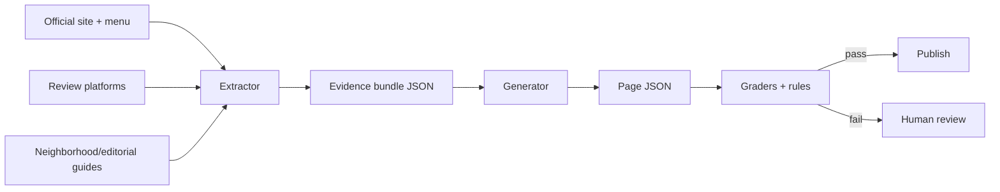
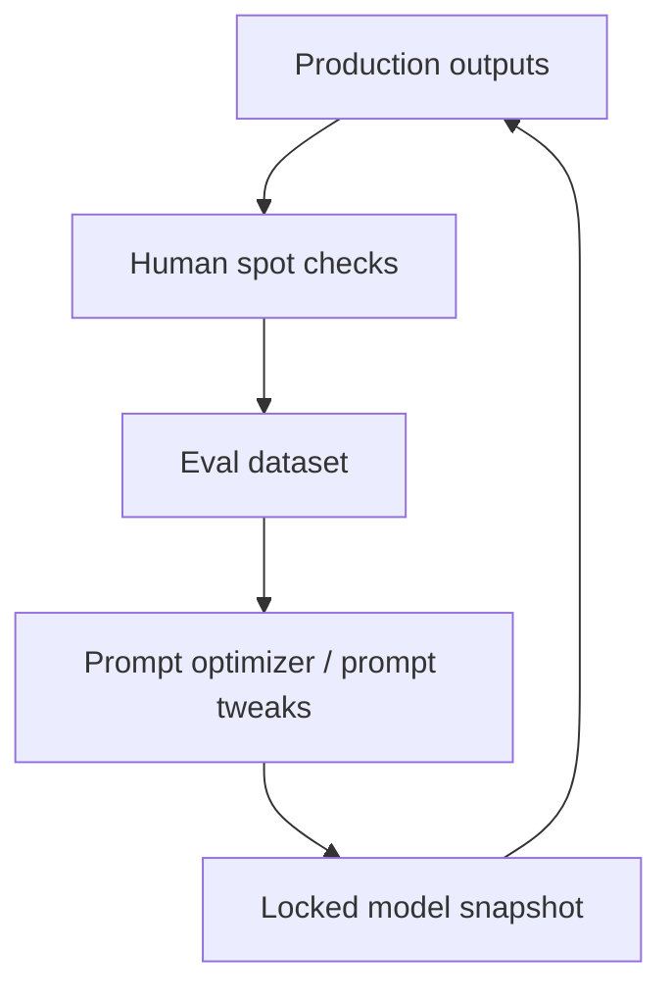

# Designing SpeakLocal Place Pages That Feel Specific and Scalable

## Executive summary

SpeakLocal place pages should not behave like mini travel blogs or generic phrasebooks. For first-time U.S. travelers who already bought tickets, the page’s job is narrower and more valuable: explain why a place is worth the stop, help the traveler picture the experience before arrival, and give a few lightweight phrases tied to real tasks they can actually memorize and use. That direction aligns with broader travel behavior: Booking.com reported that 77% of travelers seek experiences representative of local culture and 73% want their spending to benefit local communities. At the same time, web-content research shows users scan rather than read deeply, especially on mobile, and respond better to concise, specific, non-promotional language and useful headings. citeturn15search2turn15search7turn17search0turn17search1

The current failure mode is not “too much copy” or “too little copy.” It is **replaceable copy**: headings that carry weak information scent, bodies that describe mood without teaching anything, and language that could fit Bali, Austin, or Lisbon with only the venue name swapped. The fix is a stable six-module architecture, a two-stage evidence-first workflow, and hard grading rules that reject generic outputs. OpenAI’s current GPT-5.5 guidance strongly supports this approach: use the Responses API, set explicit success criteria, keep stable prompt prefixes for caching, and rely on Structured Outputs rather than prompt-only JSON instructions; for tool-heavy orchestration, Codex guidance favors non-interactive, eval-driven workflows. citeturn13view0turn13view1turn21view0turn13view3turn22view0turn13view2

## User needs and jobs to be done

The user need is concise: *“I’m going there soon; tell me why this place matters, what I should notice, what I should order, and give me a few local-language wins so I feel less intimidated when I arrive.”* That is consistent with content-design guidance that stresses writing to prioritized user needs, not to internal ambitions, and with evidence that online users typically scan for the answer they need and may leave after the first section. citeturn15search1turn15search5turn15search7

The core jobs-to-be-done are simple. The page should help the traveler choose whether the venue is worth their time, anticipate the social setting and neighborhood context, decode the menu without overloading them, and rehearse a few phrases linked to likely actions such as greeting, asking for the menu, choosing a drink, adjusting sugar, asking for a recommendation, or paying. Headings matter disproportionately here: NN/g recommends headings that make sense out of context, contain useful information, and avoid broad, generic labels because users decide relevance from these cues first. citeturn20view0turn17search9

## Evidence synthesis for L’Usine Thảo Điền

Below are the most useful, concrete details for this example page. These are the kinds of specifics your system should extract before it writes anything.

- In L’Usine’s September 2025 official journal entry, the Thảo Điền branch is described as being at **24 Thao Dien** in an **industrial-inspired space** with **high ceilings**, **open layouts**, and **warm wooden accents**, positioned as more than a café: a **concept store** where design, art, and lifestyle mix with food and coffee. citeturn2view0
- The current official menu includes **Vietnamese Milk Coffee**, **Salted Caramel Coffee**, **Premium Phở**, **Squid Ink Pasta with Crab**, **Avocado Toast**, **Eggs Benedict Pulled Pork**, **Classic Bacon Eggs Benedict**, and **Crispy Chicken Salad**, which means the venue spans classic brunch, coffee, and softer local entry points rather than serving as a narrowly traditional Vietnamese stop. citeturn11view0turn11view1turn10view0
- Saigoneer’s branch coverage adds operational texture that generic copy misses: the Thảo Điền opening featured a **brunch board** with seven dishes, **ovens baking bread for all locations**, and a **two-hour free-flow beverage option** tied to weekend brunch. citeturn6view0
- Thảo Điền itself is a meaningful part of the story, not just an address. Time Out describes it as a **walkable, tree-lined neighborhood across the river** from central Ho Chi Minh City, packed with restaurants, spas, and boutiques, while Tatler Asia calls it a **leafy, riverside enclave** where creative and international communities meet. citeturn6view1turn6view2
- Local guides reinforce the same pattern: Local Insider highlights L’Usine’s **stylish, chic interior** and blend of **Vietnamese and Western flavors**, and Wandering Wheatleys describes the brand as a good place to **catch up with a friend or get work done**, with a **small shop attached**. citeturn6view3turn12view0
- Tripadvisor snippets add lived-use signals: reviewers mention **family brunch**, **friendly staff**, a **wide menu**, and the option of sitting with **air-conditioning or just fans**, which makes this sound like a place to linger rather than a quick coffee errand. citeturn8search0turn8search8

**Status uncertainty matters here.** A September 2025 official journal post still actively markets L’Usine Thảo Điền, and an official author page from the same period says the brand had **five unique destinations across Saigon**. But the current official **Locations** page lists only **Le Thanh Ton, Phu My Hung, and Saigon Centre**, while official Instagram/Facebook search results say the **24 Thao Dien branch would close on March 15**. This venue should therefore be treated as **needs verification before publication**. Verification order: official locations page, official social posts from the last 60 days, booking/call success, then Google Maps live status. citeturn2view1turn3view0turn4search0turn4search1

## Recommended page architecture

The page should be six short modules with different jobs. The examples below are synthesized from the L’Usine evidence above: high ceilings, concept-store feel, Thảo Điền context, brunch-heavy menu, and review signals around lingering rather than speed. citeturn2view0turn10view0turn11view0turn6view0turn6view1turn8search8

| Module | Purpose | Exact length constraints | L’Usine example microcopy |
|---|---|---|---|
| Why go | State the payoff fast | Heading 3–6 words; body 2 sentences; 26–42 words | **The L’Usine for Long Brunches** — This is the branch for staying longer than planned. Start with coffee, then let the morning drift toward Benedicts, phở, or pasta. |
| What it feels like | Give memorable, physical detail | Heading 3–6 words; body 2 sentences; 24–38 words | **High Ceilings, Then Coffee** — Warm wood, open space, and a little browse-and-brunch energy. It feels closer to a concept store with a café inside than a quick grab-and-go stop. |
| What to order first | Teach the menu, not just list it | Heading 3–6 words; body 3 short sentences; 34–52 words | **Start Here** — Vietnamese milk coffee is the easy local first move. Go Benedict if you want classic brunch; go Premium phở if you want a gentler step into Vietnamese comfort. |
| Best moment | Tell the traveler when it is smartest to go | Heading 3–6 words; body 2 sentences; 18–34 words | **Best When You Linger** — This one makes more sense with time. It reads better as a brunch stop, family stop, or slow coffee stop than a rushed in-and-out. |
| Why this neighborhood | Explain why this branch matters | Heading 3–6 words; body 2 sentences; 24–40 words | **Why Thảo Điền Fits** — Across the river, Thảo Điền is greener, leafier, and more browseable than central Saigon. That calmer neighborhood energy is part of why this branch works. |
| Useful phrases here | Tie language to real tasks | Heading 2–4 words; body 1 sentence + 4–6 phrases | **Useful Here** — Ask for the menu, order a Vietnamese milk coffee, say less sugar, ask what they recommend, and check if card is okay. |

A small comparison shows the directional shift:

| Current copy | Recommended microcopy | Why it wins |
|---|---|---|
| “A Slower Thao Dien Morning” | “The L’Usine for Long Brunches” | Names the use case, not just the mood |
| “Why This Branch Works” | “Why Thảo Điền Fits” | Carries actual information scent |
| “Popular Here” | “Start Here” | Helps the traveler choose |

## Repeatable Kodex workflow and prompts

Use a **two-stage pipeline**. GPT-5.5 guidance says to define the outcome clearly, use low/medium verbosity intentionally, keep stable prompt sections first for caching, and use Structured Outputs instead of embedding the schema in the prompt. For coding/orchestration, Codex guidance and the GPT-5.2-Codex model docs support tool-heavy, long-horizon workflows with structured outputs and snapshots. citeturn13view0turn13view1turn21view0turn13view3turn13view5



**Extraction schema**
```json
{
  "venue": {"name":"","city":"","country":"","language":"en-US"},
  "status": {"value":"ok|needs_verification|closed","confidence":0,"issue":"","evidence":[]},
  "official": {
    "primary_url":"","locations_page_present":false,"menu_url":"",
    "features":[],"menu_items":[]
  },
  "context": {"neighborhood_points":[]},
  "reviews": {"tripadvisor_patterns":[],"google_patterns":[]},
  "editorial_angles": [],
  "sources": [{"label":"","url":"","type":"official|review|editorial","trust":"high|medium"}]
}
```

**Generation output schema**
```json
{
  "status":"ok|needs_verification|closed",
  "status_issue":"",
  "page":{
    "intro":{"heading":"","body":""},
    "why_go":{"heading":"","body":""},
    "what_to_order":{"heading":"","body":""},
    "best_moment":{"heading":"","body":""},
    "neighborhood_context":{"heading":"","body":""},
    "useful_phrases":{"heading":"","body":"","phrases":[]}
  },
  "source_refs":[]
}
```

**Stage-one system prompt**
```text
You extract evidence bundles for SpeakLocal place pages.
Prioritize official sources, then major review platforms, then reputable local/editorial guides.
Resolve venue status first. If status is uncertain, mark needs_verification.
Extract only concrete details a traveler can learn from: physical setting, neighborhood context, representative menu items, timing signals, repeat review patterns, and phrase-relevant tasks.
Do not write marketing copy. Do not invent claims. Return only structured output.
```

**Stage-one user prompt**
```text
Build an evidence bundle for:
Venue: {{venue_name}}
City/Country: {{city}}, {{country}}
Audience: first-time U.S. travelers
Language: en-US
Required source classes: official site, official menu, review platforms, neighborhood/editorial sources.
```

**Stage-two system prompt**
```text
You write SpeakLocal place pages from an evidence bundle only.

Goal: make the traveler more informed, more confident, and more excited.
Tone: warm, observant, lightly editorial, never gushy.
Hard rules:
- Every module must contain at least one concrete place-specific detail.
- If the copy could fit another venue by swapping names, rewrite it.
- No generic headings such as Why This Works, The Vibe, Useful Here, Popular Here.
- No clichés: hidden gem, must-visit, vibrant atmosphere, nestled, perfect spot.
- Phrase help must be lightweight and task-tied, not a phrasebook lesson.
- If status is needs_verification or closed, do not output normal page copy; return status_issue.
Return only structured output.
```

**Stage-two user prompt**
```text
Write the page from this evidence bundle: {{evidence_bundle_json}}
```



A short L’Usine example, assuming status remains unverified:

```json
{
  "status": "needs_verification",
  "status_issue": "Official sources conflict on whether the 24 Thao Dien branch is still operating.",
  "source_refs": ["official_journal_2025_09", "locations_page_current", "official_social_farewell"]
}
```

## QA rubric and rollout

**Pass/fail rubric**

- Fail if status is uncertain and the page does not return `needs_verification`.
- Fail if fewer than **4** concrete venue-specific details appear across the page.
- Fail if fewer than **3** representative food/drink items are named when a menu is available.
- Fail if any heading matches a generic denylist.
- Fail if useful phrases are not clearly tied to tasks at this venue.

**Sample tests**

```json
{"test":"generic_heading","bad":"Why This Branch Works","good":"Why Thao Dien Fits"}
{"test":"replaceable_body","bad":"A lovely cafe with great ambiance.","good":"High ceilings, warm wood, and a small browse-and-brunch feel set this branch apart."}
{"test":"phrase_drift","bad":"How do I get to the airport?","good":"Can I see the menu? / Less sugar, please. / Can I pay by card?"}
```

For rollout, start with a fixed prompt-and-schema pair, lock the model snapshot for stability, and build evals before broad deployment; OpenAI’s docs explicitly recommend eval-driven development, continuous evaluation, graders, and prompt optimization based on datasets rather than “vibe-based” judgment. Use **gpt-5.5** for extraction and writing through the Responses API with `text.verbosity: low`; use **gpt-5.2-codex** for tool-heavy scraping, normalization, and CI-style QA if you want a coding agent in the loop. Keep the stable system prompt first and venue-specific bundle last to maximize prompt caching. citeturn13view0turn13view2turn22view0turn22view1turn22view2turn13view5

A practical review ratio is: review every page for the first 50 venues; then move to **100% review for any venue with status conflicts, sparse evidence, or new-country launches**, and **10–20% spot checks** for low-risk regenerated pages. Run freshness checks on status and locations more often than copy refreshes; venues change faster than prose. In short: **fix the evidence layer first, keep the page architecture stable, and reject any output that is specific-sounding but not specific.**