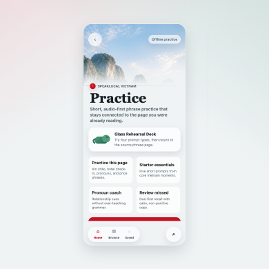

# Practice Quiz Visual Concepts

Status: design exploration and implementation handoff for the pre-live Practice/Quiz lane
Task: T-162
Scope: docs-only design packet plus static browser prototype

## Recommendation

Primary direction: **Glass Rehearsal Deck**.

This should be the first native Practice shape because it fits the current app instead of competing with it. The session feels like the `Xin chào` article page becoming interactive for a few minutes: stable glass chrome, a readable white prompt surface, speaker-first Vietnamese recognition, phrase-choice recall, calm feedback, and a clear way back to the source listing page. It supports every MVP mode without needing a full game map, accounts, timers, or a noisy reward economy.

Fallback / alternate direction: **Market Mission**.

Use this when Jojo wants a stronger scenario wrapper for Home and Search/Browse entry. It turns decks into travel moments like hotel desk, taxi, food, airport, and market. It is more memorable than plain cards, but it needs careful restraint so it does not drift into a separate game shell.

Do not start with **Chameleon Passport** as the primary app structure. Keep its mascot progression and motif unlocks, but use them as a quiet layer on top of practice completion rather than the navigation system.

## Preview Instructions

Preferred:

1. Open `docs/design/practice-quiz-concepts/prototype.html` directly in the Codex in-app browser or a normal browser.
2. The first speaker button tries to play existing local `Xin chào` audio from `native-ios/Resources/Audio/polite-1.mp3`.
3. If local file audio is blocked by the browser, the speaker control still behaves as a visual audio affordance.

Fallback:

```bash
python3 -m http.server 8787 -d docs/design/practice-quiz-concepts
```

Then open `http://127.0.0.1:8787/prototype.html`. In this mode, the prototype remains clickable, but the real audio file and masthead image may not be reachable because the server root is the design folder.

Captured preview thumbnail:



## Source References Inspected

- `docs/PRACTICE_QUIZ_PRELIVE_PLAN.md`
- `docs/APP_FAMILY_STRUCTURE.md`
- `docs/PHRASE_RELATIONSHIP_MODEL.md`
- `docs/V2_CONTENT_MODEL.md`
- `docs/PRIORITIES.md`
- `native-ios/AGENTS.md`
- `native-ios/App/Views/PhraseListingView.swift`
- `native-ios/App/Views/PhraseDetailView.swift`
- `native-ios/App/Views/AppShellView.swift`
- `native-ios/App/Models/PhrasePage.swift`
- `native-ios/App/Design/NativeGlass.swift`
- `native-ios/Resources/viet-authored-listing-pages.json`
- `native-ios/Resources/viet-phrase-catalog.json`
- `native-ios/Resources/viet-audio-manifest.json`
- `native-ios/Resources/Assets.xcassets`

Current reality that shaped the packet:

- Practice does not exist in the native app yet.
- `Practice it` exists only as a legacy label in fallback detail pages, not as a system.
- `native-ios/Resources/Assets.xcassets` has app icon, accent color, `HeroXinChao`, and `HeroVietnamMasthead`; there is no usable mascot asset.
- The app shell already owns static bottom glass chrome, search island morphing, back/forward navigation, and readable white article sections.
- Existing audio manifest entries include `polite-1` for `Xin chao`, `hotel-1` for `Toi co dat phong`, `hotel-2`, `repair-english-help`, and `price-1`.
- The live bottom dock order is `Home`, `Browse`, `Saved`.
- The current authored pronoun/relationship evidence for older-woman practice comes from `viet-how-are-you` / `Bạn khỏe không?`, especially the `relationship-forms` section with `Chị khỏe không?`.

## Design Principles

- Practice is traveler rehearsal, not a classroom course.
- The source listing page remains the teaching authority.
- Audio controls must imply bundled audio or a known future audit item.
- Sessions should be short: 3 to 5 prompts for a page and about 5 prompts for a deck.
- Feedback should explain the travel cue without punitive copy.
- Progress should mean readiness, coverage, confidence, and local familiarity.
- The chameleon is a calm guide, not a mascot that takes over the learning loop.
- Health, emergency, police, money dispute, and safety prompts should use minimal or no mascot presence.
- Every prompt must require Vietnamese language recognition or Vietnamese phrase choice. Avoid travel-common-sense questions where the user can answer without reading or listening to Vietnamese.
- Answer choices should show Vietnamese first. Do not reveal English translations under every option before selection; show English and explanation after the user answers.

## Concept 1: Glass Rehearsal Deck

Target user feeling: "I just read this phrase page, and now I can try it without leaving the app's calm rhythm."

Screen-flow sketch:

1. Home or source listing page shows a compact glass `Practice` action.
2. Deck picker shows `Starter essentials`, `This page`, `Pronouns`, `Missed`, and category decks.
3. Prompt card floats above the same stable bottom chrome.
4. Speaker button sits first when the prompt uses audio, then Vietnamese answer choices.
5. Feedback expands in place after selection with the English meaning and phrase-page explanation.
6. Progress strip and subtle chameleon motif update.
7. Completion offers `Review missed`, `Open source page`, and `Keep going`.

Question types supported:

- Listen And Choose
- Situation Pick
- Pronoun Coach
- Practice This Page
- Review Missed

Entry points:

- Home: `Practice` quick-access card with due missed count and starter deck.
- Search/Browse: category rows can show `Practice 5`.
- Saved: saved/recent deck after local progress exists.
- Listing page: `Practice this page` near the hero/player or after the first phrase section.

Reward/progress model:

- Session progress is shown as answered prompts and covered cues.
- Correct answers add a small motif chip such as lotus, lantern, wave, or star.
- Missed answers become a calm `Review later` queue, not a penalty.

Mascot role:

- Appears as a small guide on deck selection and completion; future native prompt screens can show a compact progress mark only when it does not crowd phrase choices or controls.
- Gains subtle Vietnam pattern details after completion.
- Stays out of the answer-choice area.

Fit with SpeakLocal:

- Best fit. It keeps the listing-page article rhythm, supports audio-first learning, and avoids a separate game metaphor.

## Concept 2: Market Mission

Target user feeling: "I am rehearsing one real travel moment before I walk into it."

Screen-flow sketch:

1. Home presents mission rows like `Hotel desk`, `Taxi ride`, `Coffee order`, and `Market price`.
2. A mission opens with one situation sentence and 3 to 5 prompts.
3. The prompt copy names the moment: "You are checking in and already booked."
4. User chooses from Vietnamese phrase options first, without English translations visible under every answer.
5. Completion summarizes the phrase skill: "Hotel check-in phrase ready."

Question types supported:

- Situation Pick
- Listen And Choose
- Pronoun Coach when the situation has explicit social-role evidence
- Review Missed from the same mission

Entry points:

- Home: strongest entry point as a row of travel moments.
- Search/Browse: category pages open matching missions.
- Saved: saved phrases can group into a personal mission later.
- Listing page: source page can suggest a relevant mission after practice.

Reward/progress model:

- Rewards are readiness labels: `Hotel desk ready`, `Market price cue`, `Taxi basics`.
- Avoid score language. Use coverage and confidence instead.

Mascot role:

- The chameleon can carry a small "field note" after a prompt.
- It should stay neutral or absent in sensitive missions.

Fit with SpeakLocal:

- Good alternate. It is highly traveler-centered, but it can become too game-like if every deck needs a scene wrapper.

## Concept 3: Chameleon Passport

Target user feeling: "My companion is gradually learning to belong in Vietnam as I practice."

Screen-flow sketch:

1. Practice hub shows the chameleon in a simple passport-style progress panel.
2. Country motif track shows Vietnam details as understated unlocks.
3. User chooses a practice deck.
4. Completion adds one motif detail and one readiness note.
5. Passport screen remains optional and never blocks practice.

Question types supported:

- All MVP modes, but the concept is mostly the reward wrapper rather than the prompt format.

Entry points:

- Home: small progress companion card.
- Search/Browse: category practice contributes to motif coverage.
- Saved: saved/missed practice can fill gaps.
- Listing page: page practice can unlock a page-specific motif.

Reward/progress model:

- Base companion starts neutral.
- Vietnam camouflage appears in stages: red/yellow accent stripe, lotus outline, lantern scale, Ha Long wave, small star mark.
- User earns visible coverage, not loot.

Mascot role:

- Central to the reward layer.
- Must remain optional and quiet inside the prompt loop.

Fit with SpeakLocal:

- Strong as a progression system. Risky as the main interface because it could pull attention away from phrases.

## Concept 4: Ha Long Route

Target user feeling: "I am calmly moving through phrase stops on a route, not grinding a course."

Screen-flow sketch:

1. Practice hub shows a quiet route with 5 phrase stops.
2. Each stop opens one prompt.
3. Completed stops gain a soft wave/limestone marker.
4. Missed prompts remain visible as a revisit stop.
5. Completion opens next route or source page.

Question types supported:

- Listen And Choose
- Situation Pick
- Practice This Page
- Review Missed

Entry points:

- Home: route cards for starter, hotel, transport, food.
- Search/Browse: category opens its route.
- Saved: saved route later.
- Listing page: focused route from current page.

Reward/progress model:

- Progress is movement through phrase stops.
- Completion unlocks a calm route stamp or motif.

Mascot role:

- Appears at the route edge, not on every prompt.
- Adds a subtle route note after completion.

Fit with SpeakLocal:

- Visually attractive and calm. It is heavier than needed for MVP and may require map/route art before the phrase loop is ready.

## Concept 5: Conversation Rehearsal

Target user feeling: "I can choose what to say next in a tiny local exchange."

Screen-flow sketch:

1. User chooses an interaction such as hotel check-in, taxi destination, or market price.
2. The app shows one local line or situation cue.
3. User chooses the best next phrase.
4. Feedback explains why the phrase fits.
5. The next prompt branches only lightly, keeping the path deterministic.

Question types supported:

- Situation Pick
- Pronoun Coach
- Practice This Page
- Later: likely-reply prompts from the phrase graph

Entry points:

- Home: `Rehearse a conversation` after basic decks exist.
- Search/Browse: scenario-based entry.
- Saved: saved phrases can seed a short exchange later.
- Listing page: `Try this in a conversation` only when source links are clean.

Reward/progress model:

- Rewards are completed exchanges and useful next-step confidence.
- Missed items link back to the exact page that taught the distinction.

Mascot role:

- A small facilitator before and after the exchange.
- Should not pretend to be the local speaker unless a future script task designs that safely.

Fit with SpeakLocal:

- Product-rich, but better after the canonical graph and likely-reply data are stronger.

## MVP Mode Coverage

| MVP mode | Best concept treatment | Notes |
| --- | --- | --- |
| Listen And Choose | Glass Rehearsal Deck | Speaker-first prompt; user chooses the Vietnamese phrase they heard, then sees English. |
| Situation Pick | Market Mission or Glass Rehearsal Deck | Situation sentence plus Vietnamese phrase choices; reveal English/explanation after selection. |
| Pronoun Coach | Glass Rehearsal Deck | Relationship cue plus Vietnamese phrase choices; only use authored evidence. |
| Practice This Page | Glass Rehearsal Deck | Source page opens a 3 to 5 prompt deck that asks for Vietnamese recognition or phrase choice and returns to that page. |
| Review Missed | Glass Rehearsal Deck | Due-first phrase recall with positive copy and no punishment framing. |

## Practice User Flow

1. Deck selection: user chooses `This page`, `Starter essentials`, a category, `Pronoun Coach`, or `Review missed`.
2. Prompt screen: one clear language task with a speaker control when audio is available.
3. Answer selection: options show Vietnamese first, are large/readable, and wrap naturally.
4. Feedback/explanation: English meaning, correct phrase, and one phrase-page cue expand after the answer.
5. Reward/progress moment: progress strip advances; chameleon gains a subtle motif detail outside the answer area.
6. Next prompt: user advances manually; no timer.
7. Completion: summary says what is now more familiar, what to review, and what source page to reopen.
8. Return or continue: `Open source page`, `Review missed`, or `Keep going`.

## Chameleon Mascot Progression

### Base Companion State

- Calm green chameleon with soft cream underside and restrained red/yellow accent pin.
- Small enough to feel like a guide, not a game character.
- Default expression is attentive, not excited.
- No speech bubbles covering phrase text.

### Vietnam Camouflage Progression

Stage 0: neutral guide
Stage 1: small red/yellow accent stripe after first completed deck
Stage 2: lotus scale detail after completing a listing-page practice deck
Stage 3: lantern edge pattern after category coverage
Stage 4: Ha Long wave/limestone tail motif after repeated review success
Stage 5: subtle star mark after broad starter coverage

### What The User Earns

- Motif details for completed practice coverage.
- Readiness labels such as `Hotel desk ready` or `Market price cue`.
- Local confidence notes that name what the user can now recognize or choose.
- A visible but private progress companion.

### Positive And Low-Pressure Rules

- Never remove motif progress after a miss.
- Missed prompts become `Review later`, not `Wrong pile`.
- No lives, hearts, streak debt, leaderboards, or shame copy.
- Completion can celebrate effort, but the wording should stay calm.

### Placement Rules

- Practice: appears in deck selection and completion by default; prompt screens should use the mascot only as a compact progress mark when layout has room.
- Listing pages: appears only as a small `Practice this page` companion or completion return cue.
- Completion: appears larger with the unlocked motif.
- Cultural/local tips: can point to a small local note in non-sensitive contexts.
- Sensitive contexts: mascot is absent or reduced to a neutral progress mark.

### Generalization To Other Country Packs

- Keep the base chameleon shape constant.
- Swap motif layers per country pack.
- Keep progress semantics the same: coverage, readiness, source-page confidence.
- Country-specific motifs must be tasteful and restrained, not costume changes.

## Screenshot-Ready Visual States

The prototype includes these reviewable states:

- start/deck selection surface;
- Listen And Choose prompt with speaker control and Vietnamese phrase choices;
- Situation Pick prompt with Vietnamese choices first and English revealed after selection;
- Pronoun Coach prompt anchored to `Bạn khỏe không?` relationship forms;
- Practice This Page / Review Missed prompt that tests phrase recall instead of travel common sense;
- feedback expanded under an answer;
- completion moment with chameleon motif progression;
- conceptual return to source listing page.

## Image-Generation Prompts

Use these later if a visual asset task creates concept boards or mascot assets. Keep generated images as concept references until a native asset task approves final exports.

### Mascot Prompt

Create a polished product-design mascot sheet for a premium native iOS travel phrase app called SpeakLocal. The mascot is a warm, calm chameleon companion, not childish, with a refined green body, cream underside, and subtle Vietnam red/yellow motif details. Show seven poses on a clean light background: neutral guide, listening, correct, try again, hint, local cultural note, completed mini-session. The style should feel Apple-native, tactile, restrained, and suitable beside Liquid Glass UI surfaces. Avoid loud game loot, cartoon exaggeration, text, badges, coins, streak icons, or competitive elements.

### Glass Rehearsal Deck Prompt

Design an iPhone product mockup for SpeakLocal Practice: a calm Liquid Glass-style Vietnamese phrase quiz screen with stable bottom search/home chrome, readable white prompt area, speaker-first audio button, four large Vietnamese answer choices, subtle red/yellow Vietnam accents, and a small refined chameleon progress companion. Show one feedback state where English meaning and explanation appear only after selection. The screen should feel like an interactive phrasebook extension of an article-style phrase page, not a game, classroom app, or travel etiquette quiz.

### Market Mission Prompt

Design an iPhone concept for a SpeakLocal hotel-desk practice mission. Use a native iOS visual language with glass chrome, white content surfaces, restrained Vietnam accents, and a small mission header. The prompt should show Vietnamese phrase choices first for a real check-in moment, with English meaning revealed only after answer selection. Include a calm chameleon guide as a small side detail, not the central character. Avoid timers, hearts, scoreboards, or game maps.

### Chameleon Passport Prompt

Design a refined iPhone progress screen for a travel phrase app where a chameleon gradually camouflages into Vietnam motifs. Show a calm passport-style progress surface with tasteful red/yellow accents, lotus, lantern, star, wave, and Ha Long limestone motif details. The interface should feel premium, quiet, native, and private. Avoid childish stickers, coins, badges, loud rewards, or leaderboard elements.

### Ha Long Route Prompt

Design an iPhone practice route concept for SpeakLocal with a calm Ha Long Bay-inspired sequence of five phrase stops. Use soft white surfaces, native Liquid Glass controls, subtle limestone/wave shapes, and compact phrase-progress markers. The screen should be reviewable as a product mockup and should not look like a fantasy map or game level.

### Conversation Rehearsal Prompt

Design an iPhone mockup for a tiny Vietnamese conversation rehearsal in SpeakLocal. Show one local interaction cue, three possible Vietnamese traveler replies, a speaker replay button, and a short explanation after selection of what the selected phrase means and why it fits. Use native iOS glass chrome, readable white panels, restrained Vietnam accents, and a small chameleon facilitator outside the answer area.

## Future SwiftUI Handoff

Likely native screens/components:

- `PracticeHubView`: deck entry from Home/Search/Browse/Saved.
- `PracticeSessionView`: prompt loop, answer state, feedback, next prompt.
- `PracticePromptCard`: question, speaker control, source context, answer choices.
- `PracticeFeedbackView`: correct answer, one-line cue, source-page link.
- `PracticeProgressStrip`: prompt count, due/missed state, motif progress.
- `ChameleonProgressView`: optional companion and motif layer.
- `PracticeCompletionView`: readiness summary, review missed, open source page, keep going.

Likely data dependencies:

- Generated deterministic practice decks.
- Practice-specific audio audit.
- Source page/family/phrase IDs resolved against authored listing pages.
- Local-only progress state with `seenCount`, `correctStreak`, `missedCount`, `lastSeenAt`, `nextDueAt`, and source IDs.

Native implementation notes:

- Use the existing app shell's stable bottom chrome; do not create a second tab bar.
- Add `Practice` as Home quick access first; wait on permanent bottom-chrome expansion until simulator/device proof.
- Use `GlassEffectContainer` for grouped glass controls and native fallback materials for earlier OS versions.
- Keep choice rows flexible with wrapping text and at least 44 point tap targets.
- Keep quiz choices language-first: Vietnamese visible before selection; English meaning and explanation revealed only after selection.
- Keep real audio controls wired through `AudioAssetManifest`; if an audio key is unresolved, do not show a speaker icon.
- Source-page return should route through the existing canonical page graph.
- Mascot integration should be optional per prompt and suppressed for serious contexts.
- Pronoun Coach production prompts should source the first release from authored pages such as `viet-how-are-you`, where `Chị khỏe không?` and nearby relationship forms are explicit. Do not promote unanchored greeting variants into practice until their source page/section IDs resolve.
